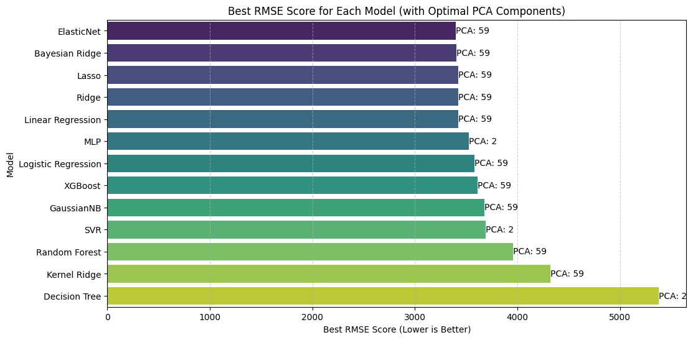

# Datathon 2025 

This is the task for the regression challenge in Datathon 2025

The task and description of dataset features can be found in [Regression description](Regression-desc.pdf).

final_work.ipynb contains the best version of the task and how it should have been analyzed etc.

datahon-day.ipynb is the notebook file created during the datathon and post-datathon.ipynb has the work and testing done just before the submition of the final report.

I am still unclear how I got the results from img below Best result from pre-processing as I cannot reproduce it anymore. 

 
First testing 
    - Removed url column 
    - Removed zero word articles 
    - Outlier check with Z-score, from 27681 articles to 14853 
    - Best model: Linear Regression 
    - Best score: 8334 
    - PCA: 59 
 
Second testing 
    * Removed url column 
    * Eliminating outliers by "hand" 
        - removed all articles with shares > 80,000 
        - removed all articles with n_tokens_content > 4000 
        - removed all articles with zero words, 862 articles 
        - from 28543 articles to 27599 from zero words, 82 articles removed by the shares and n_tokens_content
    - Best model: MLP 
    - Best score: 5338 
    - PCA: 15 
    - Notable models Lasso, Ridge, Baysian Ridge, Elastic Net. Score: 5372 - 5382 